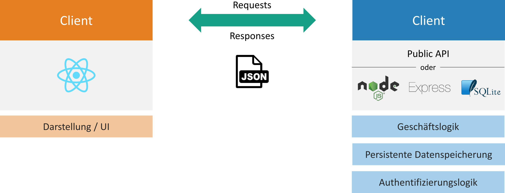

# REST-APIs in React (Native) verwenden

Dies ist eine Anleitung, um eine REST-API zu entwickeln und diese in einem React-Frontend zu verwenden. Mit Hilfe von REST-APIs können Client und Server miteinander kommunizieren. Sie sind sozusagen der »Klebstoff« zwischen Client und Server, also zwischen Front- und Backend.

## Beispiel Bücherverwaltungsanwendung

Zur Verdeutlichung folgendes Beispiel einer Büchereiverwaltungsanwendung: Das Frontend der Anwendung verwendet eine API, um eine Liste der ausleihbaren Bücher zu laden. Die dazu notwendigen Daten werden in einer Datenbank auf dem Server gespeichert. Nun möchte der Nutzer ein Buch ausleihen. Dazu muss ein entsprechender Datenbankeintrag auf dem Server geändert werden. Der Nutzer stößt dies ebenfalls über einen API-Aufruf an (ggf. nach erfolgreicher Authentifizierung). Das Beispiel lässt sich noch beliebig erweitern: Beispielsweise könnten neue Bücher hinzugefügt oder Bücher gelöscht werden.

## Verschiedene Möglichkeiten zur Umsetzung des Backends

Zur Umsetzung des Backends werden nachfolgend zwei verschiedene Varianten vorgestellt:

-   Nutzung einer existierenden, öffentlichen API (Public API)
-   Erstellung einer eigenen API mit Node.js, Express und SQLite

Die folgende Abbildung veranschaulicht den Datenaustausch zwischen Client und Server. Der Client, in unserem Fall ein React-Frontend, stellt das User Interface (UI) dar, mit dem der Anwender interagiert. Der Server implementiert die Geschäfts- und Authentifizierungslogik (falls vorhanden) und dient zur persistenten Datenspeicherung. Client und Server kommunizieren über eine REST-API, die Daten werden im JSON-Format ausgetauscht.



Im Frontend dieser Testanwendung kommt das CSS-Framework [Bootstrap](https://getbootstrap.com/) zum Einsatz, damit wir keine Zeit fürs Styling der Komponenten aufwenden müssen.

## Nutzung einer existierenden, öffentlichen API (Public API)

Die Verwendung einer bereits existierenden, öffentlichen API eignet sich dann, wenn beispielsweise öffentliche zugängliche Informationen wie Wechselkurse oder das Wetter abgerufen werden sollen.

### Auswahl einer Public API

Eine Übersicht von öffentlichen APIs finden Sie unter https://www.programmableweb.com. Wählen Sie hier eine für Ihren Anwendungsfall passende API aus. Um eine ausgewählte, öffentliche API anzubinden, sollte definitiv die API-Dokumentation gelesen werden. Darin sind die verschiedenen Endpunkte und passende Query-Parameter zu finden.

In unserem Beispiel wollen wir historische Bitcoin-Preise der letzten Tage abfragen und in unserem React-Frontend anzeigen. Dazu nutze ich die API von [cryptocompare](https://min-api.cryptocompare.com/documentation?key=Historical&cat=dataHistoday). Wichtige Anfrage-Parameter sind:

-   `fsym`: Die Kryptowährung, dessen Preis uns interessiert (`'BTC'`)
-   `tsym`: Die Währung des Preises (z. B. `'EUR'` oder `'USD'`)
-   `limit`: Die Anzahl an Datenpunkten (in unserem Fall die Anzahl an Tagen)

### Anbindung der API

Die Anbindung der API geschieht im besten Fall in einer separaten Javascript-Datei. Dazu lege ich die Datei `crypto-api.js` im Ordner `src/api` an. Als erstes definieren wir die API-Backend-URL als Konstante:

```javascript
const API_BACKEND_URL = 'https://min-api.cryptocompare.com/data/v2/'
```

Anschließend erstellen wir die Funktion `getBitcoinHistory`, die wir in verschiedenen Komponenten im Frontend aufrufen können. Das Schlüsselwort `default` ist notwendig, damit wir die Funktion in anderen Javascript-Dateien verwenden können. Funktionsparameter sind `numberOfDays` mit Default-Wert `10` und `currency` mit Default-Wert `'EUR'`. Wir nutzen die native Javascript-Methode `fetch`, der wir den Endpunkt übergeben und die uns ein Promise zurückliefert ([Dokumentation von fetch](https://developer.mozilla.org/en-US/docs/Web/API/Fetch_API/Using_Fetch)).
Auf dem Promise rufen wir zunächst `then` auf, um die Response des Servers in ein JSON-Objekt zu transformieren. Das zweite `then` sorgt dafür, dass wir die Server-Antwort (ein JSON-Objekt) auf ein Array mappen, das Objekte mit den Properties enthält, die wir im Frontend benötigen. (Zudem wird der Unix-Timestamp vom Server als Date-Objekt geparsed). Schließlich wird das Array mit `reverse()` »umgedreht«, da wir das Array nach Datum absteigend sortieren möchten (neue Daten kommen zuerst).

```javascript
export function getBitcoinHistory(numberOfDays = 10, currency = 'EUR') {
    return fetch(
        `${API_BACKEND_URL}histoday?fsym=BTC&tsym=${currency}&limit=${numberOfDays}`
    )
        .then((response) => response.json())
        .then((jsonResponse) => {
            return jsonResponse.Data.Data.map((data) => {
                return {
                    date: new Date(+data.time * 1000),
                    open: data.open,
                    close: data.close,
                    high: data.high,
                    low: data.low,
                }
            })
        })
        .then((bitcoinPrices) => bitcoinPrices.reverse())
}
```

### API-Aufruf in einer Komponente

Um die historischen Bitcoin-Preise im Frontend anzuzeigen, muss die eben erstellte Funktion in einer React-Komponente aufgerufen werden. Dies geschieht innerhalb der useEffect-Hook von React, da wir die Daten zu Beginn laden möchten, aber nicht bei jedem Rendern der Komponente. Wichtig ist, dass der zweite Parameter von useEffect ein leeres Array ist. Lassen wir den Parameter weg, dann landen wir in einer Endlosschleife: Der hook wird ausgefüht, wenn die Komponente mounted, aber auch, wenn die Komponente aktualisiert wird. Da wir den state nach dem Fetchen der Daten vom Server aktualisieren, wird die Komponente aktualisiert und der effekt-Hook startet von vorn.

```javascript
function BitcoinHistory(props) {
    const [isLoading, setIsLoading] = useState(true)
    const [bitcoinPrices, setBitcoinPrices] = useState([])

    useEffect(() => {
        setIsLoading(true)
        getBitcoinHistory(10, 'EUR')
            .then((bitcoinPrices) => setBitcoinPrices(bitcoinPrices))
            .finally(() => setIsLoading(false))
    }, [])

    if (isLoading) {
        return (
            <div className="d-flex justify-content-center">
                <div className="spinner-border" role="status">
                    <span className="visually-hidden">Loading...</span>
                </div>
            </div>
        )
    }

    const dateOptions = {
        year: 'numeric',
        month: '2-digit',
        day: '2-digit',
    }

    return (
        <div>
            <table className="table table-striped table-hover">
                <thead>
                    <tr>
                        <th>Datum</th>
                        <th>Eröffnung</th>
                        <th>Hoch</th>
                        <th>Tief</th>
                        <th>Schluss</th>
                    </tr>
                </thead>
                <tbody>
                    {bitcoinPrices.map((bitcoinPrice) => (
                        <tr key={bitcoinPrice.date}>
                            <td>
                                {bitcoinPrice.date.toLocaleString(
                                    'de-DE',
                                    dateOptions
                                )}
                            </td>
                            <td>{bitcoinPrice.open.toLocaleString('de-DE')}</td>
                            <td>{bitcoinPrice.high.toLocaleString('de-DE')}</td>
                            <td>{bitcoinPrice.low.toLocaleString('de-DE')}</td>
                            <td>
                                {bitcoinPrice.close.toLocaleString('de-DE')}
                            </td>
                        </tr>
                    ))}
                </tbody>
            </table>
        </div>
    )
}
```

Während die Daten geladen werden, wird ein Loading Spinner angezeigt. Sobald die Bitcoin-Preise im Frontend verfügbar sind, wird eine entsprechende Tabelle dargestellt.

## Erstellung einer eigenen API mit Node.js, Express und SQLite

tbd
