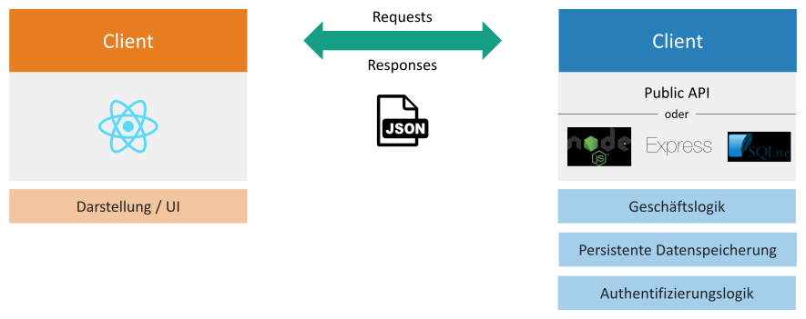

# REST-APIs in React (Native) verwenden

Dies ist eine Anleitung, um REST-APIs in einem React-Frontend zu verwenden. Mit Hilfe von REST-APIs können Client und Server miteinander kommunizieren und Daten austauschen. Sie sind sozusagen der »Klebstoff« zwischen Client und Server, also zwischen Front- und Backend.

Zur Verdeutlichung folgendes Beispiel einer Bücherverwaltungsanwendung: Das Frontend der Anwendung verwendet eine API, um eine Liste aller gespeicherten Bücher zu laden. Die dazu notwendigen Daten werden in einer Datenbank auf dem Server gespeichert. Zusätzlich kann der Nutzer neue Bücher hinzufügen, existierende Bücher bearbeiten und Bücher löschen.

## Möglichkeiten zur Nutzung von APIs

Prinzipiell gibt es zwei Möglichkeiten, das Frontend um eine API zu erweitern:

-   Nutzung einer existierenden, öffentlichen API (Public API)
-   Erstellung einer eigenen API (in dieser Anleitung mit Node.js, Express und SQLite)

Die folgende Abbildung veranschaulicht den Datenaustausch zwischen Client und Server. Der Client, in unserem Fall ein React-Frontend, stellt das User Interface (UI) dar, mit dem der Anwender interagiert. Der Server implementiert die Geschäfts- und Authentifizierungslogik (falls vorhanden) und dient zur persistenten Datenspeicherung. Client und Server kommunizieren über eine REST-API, die Daten werden im JSON-Format ausgetauscht.



Anmerkung: Im Frontend dieser Testanwendung kommt das CSS-Framework [Bootstrap](https://getbootstrap.com/) zum Einsatz, damit wir keine Zeit fürs Schreiben von CSS aufwenden müssen.

## Beispielprojekt öffnen

In diesem Repository befindet sich ein Beispielprojekt. Dort wird zum einen eine Public API zum Laden von Bitcoinpreisen verwendet. Zum anderen beinhaltet das Beispielprojekt ein eigenes Backend, dessen API ebenfalls im React-Frontend verwendet wird.

Schritte zum Öffnen des Beispielprojekts:

1. Klonen Sie sich das Repository.
2. Öffnen Sie den Ordner `backend` in einer neuen Kommandozeile und installieren Sie alle Abhängigkeiten:
    ```
    cd backend
    npm install
    ```
3. Starten Sie das Backend:
    ```
    npm start:server
    ```
4. Öffnen Sie den Ordner `frontend` und installieren Sie alle Abhängigkeiten:
    ```
    cd frontend
    npm install
    ```
5. Starten Sie das Frontend:
    ```
    npm start
    ```
    Die Website sollte sich automatisch öffnen. Ansonsten ist die Website über die URL `http://localhost:3000` verfügbar.

## Nutzung einer existierenden, öffentlichen API (Public API)

Die Verwendung einer bereits existierenden, öffentlichen API eignet sich dann, wenn beispielsweise öffentliche zugängliche Informationen wie Währungswechselkurse oder Wetterdaten abgerufen werden sollen.

### Auswahl einer Public API

Eine Übersicht von öffentlichen APIs finden Sie unter https://www.programmableweb.com. Wählen Sie hier eine für Ihren Anwendungsfall passende API aus. Um eine öffentliche API anzubinden, sollte definitiv die API-Dokumentation gelesen werden. Darin sind die verschiedenen Endpunkte und Query-Parameter zu finden.

In unserem Beispiel wollen wir historische Bitcoin-Preise der letzten Tage abfragen und in unserem React-Frontend anzeigen. Dazu nutze ich die API von [cryptocompare](https://min-api.cryptocompare.com/documentation?key=Historical&cat=dataHistoday). Wichtige Anfrage-Parameter sind:

-   `fsym`: Die Kryptowährung, dessen Preis uns interessiert (`'BTC'`)
-   `tsym`: Die Währung des Preises (z. B. `'EUR'` oder `'USD'`)
-   `limit`: Die Anzahl an Datenpunkten (in unserem Fall die Anzahl an Tagen)

### Anbindung der API ans React-Frontend

Die Anbindung der API geschieht im besten Fall in einer separaten Javascript-Datei. Dazu legen wir die Datei `crypto-api.js` im Ordner `src/api` im React-Frontend an. Als erstes definieren wir die API-Backend-URL als Konstante:

```javascript
const API_BACKEND_URL = 'https://min-api.cryptocompare.com/data/v2/'
```

Anschließend erstellen wir die Funktion `getBitcoinHistory`, die wir in verschiedenen Komponenten im Frontend aufrufen können. Das Schlüsselwort `export` ist notwendig, damit wir die Funktion in anderen Javascript-Dateien verwenden können. Funktionsparameter sind `numberOfDays` mit Default-Wert `10` und `currency` mit Default-Wert `'EUR'`. Wir nutzen die native Javascript-Methode `fetch`, der wir den Endpunkt übergeben und die uns ein Promise zurückliefert ([Dokumentation von fetch](https://developer.mozilla.org/en-US/docs/Web/API/Fetch_API/Using_Fetch)).
Auf dem Promise rufen wir zunächst `then` auf, um die Response des Servers in ein JSON-Objekt zu transformieren. Das zweite `then` sorgt dafür, dass wir die Server-Antwort (ein JSON-Objekt) auf ein Array mappen, das Objekte mit den Properties enthält, die wir im Frontend benötigen. (Zudem wird der Unix-Timestamp vom Server als Date-Objekt geparsed). Schließlich wird das Array mit `reverse()` »umgedreht«, da wir das Array nach Datum absteigend sortiert benötigen.

```javascript
export function getBitcoinHistory(numberOfDays = 10, currency = 'EUR') {
    return fetch(
        `${API_BACKEND_URL}histoday?fsym=BTC&tsym=${currency}&limit=${numberOfDays}`
    )
        .then((response) => response.json())
        .then((jsonResponse) => {
            return jsonResponse.Data.Data.map((data) => {
                return {
                    date: new Date(+data.time * 1000),
                    open: data.open,
                    close: data.close,
                    high: data.high,
                    low: data.low,
                }
            })
        })
        .then((bitcoinPrices) => bitcoinPrices.reverse())
}
```

### API-Aufruf in einer Komponente

Um die historischen Bitcoin-Preise im Frontend anzuzeigen, muss die eben erstellte Funktion in einer React-Komponente aufgerufen werden. Dies geschieht innerhalb der useEffect-Hook von React, da wir die Daten zu Beginn laden möchten, aber nicht bei jedem Rendern der Komponente. Wichtig ist, dass der zweite Parameter beim Aufruf von useEffect ein leeres Array ist.

```javascript
import { useState } from 'react'
import { useEffect } from 'react'
import { getBitcoinHistory } from '../../api/crypto-api'
import LoadingSpinner from '../common/LoadingSpinner'

function BitcoinHistory() {
    const [isLoading, setIsLoading] = useState(true)
    const [bitcoinPrices, setBitcoinPrices] = useState([])

    const dateOptions = {
        year: 'numeric',
        month: '2-digit',
        day: '2-digit',
    }

    useEffect(() => {
        setIsLoading(true)
        getBitcoinHistory(10, 'EUR')
            .then((bitcoinPrices) => setBitcoinPrices(bitcoinPrices))
            .finally(() => setIsLoading(false))
    }, [])

    if (isLoading) {
        return <LoadingSpinner />
    }

    return (
        <div>
            <table className="table table-striped table-hover">
                <thead>
                    <tr>
                        <th>Datum</th>
                        <th>Eröffnung</th>
                        <th>Hoch</th>
                        <th>Tief</th>
                        <th>Schluss</th>
                    </tr>
                </thead>
                <tbody>
                    {bitcoinPrices.map((bitcoinPrice) => (
                        <tr key={bitcoinPrice.date}>
                            <td>
                                {bitcoinPrice.date.toLocaleString(
                                    'de-DE',
                                    dateOptions
                                )}
                            </td>
                            <td>{bitcoinPrice.open.toLocaleString('de-DE')}</td>
                            <td>{bitcoinPrice.high.toLocaleString('de-DE')}</td>
                            <td>{bitcoinPrice.low.toLocaleString('de-DE')}</td>
                            <td>
                                {bitcoinPrice.close.toLocaleString('de-DE')}
                            </td>
                        </tr>
                    ))}
                </tbody>
            </table>
        </div>
    )
}

export default BitcoinHistory
```

Während die Daten geladen werden, wird ein Loading Spinner angezeigt. Sobald die Bitcoin-Preise im Frontend verfügbar sind, wird eine entsprechende Tabelle dargestellt.

## Erstellung einer eigenen API mit Node.js, Express und SQLite

Im Folgenden betrachten wir die Erstellung einer eigenen API, also eines eigenen Backends. Dies ist notwendig, wenn die zu erstellende Anwendung auf einem Server individuelle Daten speichern soll wie bei der Bücherverwaltungsapp.

### Verwendete Technologien

In diesem Beispiel kommen die folgenden Technologien zum Einsatz:

-   Node.js: Eine JavaScript-Laufzeitumgebung, um serverseitig JavaScript ausführen zu können
-   Express.js: Ein serverseitiges Webframework für Node.js, mit dem die Entwicklung einer REST-API deutlich einfacher ist
-   SQLite: Eine kleine und leichtgewichtige Implementierung einer SQL-Datenbank

### Vorbereitungen

1. Laden und installieren Sie [Node.js](https://nodejs.org/en/download/) (falls noch nicht geschehen).
2. Erstellen Sie einen Ordner `backend`, in dem später der Quellcode fürs Backend gespeichert wird.
3. Navigieren Sie mit der Kommandozeile in den Backend-Ordner und erstellen Sie ein npm-Projekt:
    ```
    cd backend
    npm init -y
    ```
4. Installieren Sie mit der Kommandozeile Express:
    ```
    npm install express
    ```
5. Installieren Sie mit der Kommandozeile SQLite:
    ```
    npm install sqlite3
    ```
6. Installieren Sie mit der Kommandozeile body-parser:
    ```
    npm install body-parser
    ```
7. Optional, aber empfohlen: Installieren Sie mit der Kommandozeile nodemon zur komfortableren Entwicklung (Mit nodemon muss man das Backend nach Änderungen nicht immer manuell neustarten):
    ```
    npm install nodemon --save-dev
    ```

### Erstellung der Datenbank

Erstellen Sie im Ordner `backend` die Datei `database.js`. Für unsere Beispielanwendung nutzen wir folgenden Code:

```javascript
var sqlite3 = require('sqlite3').verbose()

const DBSOURCE = 'db.sqlite'

let db = new sqlite3.Database(DBSOURCE, (err) => {
    if (err) {
        // Cannot open database
        console.error(err.message)
        throw err
    }

    console.log('Connected to the SQLite database.')
    db.run(
        `CREATE TABLE books (
        id INTEGER PRIMARY KEY AUTOINCREMENT,
        isbn TEXT,
        title TEXT,
        subtitle TEXT,
        publication_year INTEGER,
        CONSTRAINT isbn_unique UNIQUE (isbn)
    )`,
        (err) => {
            if (err) {
                // table already created
            } else {
                // table just created, creating some rows
                const insert =
                    'INSERT INTO books (isbn, title, subtitle, publication_year) VALUES (?, ?, ?, ?)'
                db.run(insert, [
                    '978-3-86490-552-0',
                    'React',
                    'Grundlagen, fortgeschrittene Techniken und Praxistipps – mit TypeScript und Redux',
                    2019,
                ])
            }
        }
    )
})

module.exports = db
```

Als erstes werden sqlite importiert und der Dateiname für die Datenbank festgelegt. Anschließend wird eine Verbindung zur Datenbank hergestellt. Beim ersten Ausführen des Codes wird eine Tabelle `books` erstellt und ein Buch in dieser Tabelle gespeichert.

### Erstellung des Servers

Nachdem wir nun die Datenbank erstellt haben, fehlt nur noch der Server. Dazu erstellen wir eine Datei `server.js` mit folgendem Code:

```javascript
const app = require('./app')
const http = require('http')

const port = process.env.PORT || 8080

app.set('port', port)
const server = http.createServer(app)

server.listen(port)
```

Es werden die Module `app` (das wir gleich erstellen werden) sowie das `http`-Paket importiert. Zudem wird der Port des Webservers festgelegt und gesetzt. Schließlich wird der Server erstellt und aktiviert.

Nun erstellen wir eine Datei `app.js` mit folgendem Code:

```javascript
const express = require('express')
const bodyParser = require('body-parser')
const db = require('./database')
const app = express()

app.use(bodyParser.json())
app.use(bodyParser.urlencoded({ extended: false }))

app.use((request, response, next) => {
    response.setHeader('Access-Control-Allow-Origin', '*')
    response.setHeader(
        'Access-Control-Allow-Headers',
        'Origin, X-Requested-With, Content-Type, Accept'
    )
    response.setHeader(
        'Access-Control-Allow-Methods',
        'GET, POST, PATCH, DELETE, OPTIONS'
    )
    next()
})
```

Zu Beginn importieren wir wieder einige Module. Danach rufen wir einige Middleware-Funktionen auf, die bei jeder Request durchlaufen werden:

-   Der erste Aufruf von `app.use` sorgt dafür, dass der Body der Request als JSON-Objekt zur Verfügung steht.
-   Der zweite Aufruf parsed die URL-Parameter als JSON-Objekt.
-   Im dritten Aufruf werden einige Header der Response gesetzt.

Anschließend folgt der API-Endpunkt `/api/books`, der alle gespeicherten Bücher zurückgibt. In diesem Fall kommt das HTTP-Verb `GET` zum Einsatz, da lediglich Daten gelesen werden.

```javascript
app.get('/api/books', (request, response, next) => {
    const sql = 'select * from books'
    const params = []
    db.all(sql, params, (err, books) => {
        if (err) {
            response.status(400).json({
                error: err.message,
            })
            return
        }

        response.status(200).json({
            books: books,
        })
    })
})
```

Um die Informationen eines einzelnen Buches zu erhalten, kann folgender Code verwendet werden:

```javascript
app.get('/api/books/:id', (request, response, next) => {
    const sql = 'select * from books where id = ?'
    const params = [request.params.id]
    db.get(sql, params, (err, book) => {
        if (err) {
            response.status(400).json({
                error: err.message,
            })
            return
        }

        response.status(200).json({
            ...book,
        })
    })
})
```

Ein neues Buch kann wie folgt hinzugefügt werden. Hier wird das HTTP-Verb `POST` verwendet.

```javascript
app.post('/api/books/', (request, response, next) => {
    const requiredProperties = ['isbn', 'title']
    const errors = []

    requiredProperties.forEach((property) => {
        if (!request.body[property]) {
            errors.push(`Required property ${property} is missing`)
        }
    })

    if (errors.length) {
        response.status(400).json({
            error: errors.join(', '),
        })
        return
    }

    const data = {
        isbn: request.body.isbn,
        title: request.body.title,
        subtitle: request.body.subtitle,
        publication_year: request.body.publication_year,
    }

    const sql =
        'INSERT INTO books (isbn, title, subtitle, publication_year) VALUES (?, ?, ?, ?)'
    const params = [data.isbn, data.title, data.subtitle, data.publication_year]
    db.run(sql, params, function (err, result) {
        if (err) {
            response.status(400).json({ error: err.message })
            return
        }
        response.status(201).json({
            message: 'success',
            book: {
                ...data,
                id: this.lastID,
            },
        })
    })
})
```

Zum Aktualisieren eines Buchs wird das HTTP-Verb `PATCH` verwendet:

```javascript
app.patch('/api/books/:id', (request, response, next) => {
    const data = {
        isbn: request.body.isbn,
        title: request.body.title,
        subtitle: request.body.subtitle,
        publication_year: request.body.publication_year,
    }

    db.run(
        `UPDATE books set
            isbn = COALESCE(?, isbn),
            title = COALESCE(?, title),
            subtitle = COALESCE(?, subtitle),
            publication_year = COALESCE(?, publication_year)
            WHERE id = ?`,
        [
            data.isbn,
            data.title,
            data.subtitle,
            data.publication_year,
            request.params.id,
        ],
        function (err, result) {
            if (err) {
                response.status(400).json({
                    error: err.message,
                })
                return
            }
            response.status(200).json({
                book: data,
                changes: this.changes,
            })
        }
    )
})
```

Um ein Buch zu löschen, kommt das HTTP-Verb `DELETE` zum Einsatz:

```javascript
app.delete('/api/books/:id', (request, response, next) => {
    const sql = 'DELETE FROM books WHERE id = ?'
    const params = [request.params.id]
    db.run(sql, params, function (err, result) {
        if (err) {
            response.status(400).json({ error: err.message })
            return
        }
        response.status(200).json({
            message: 'deleted',
            changes: this.changes,
        })
    })
})
```

Als letztes muss noch das Modul exportiert werden:

```javascript
module.exports = app
```
